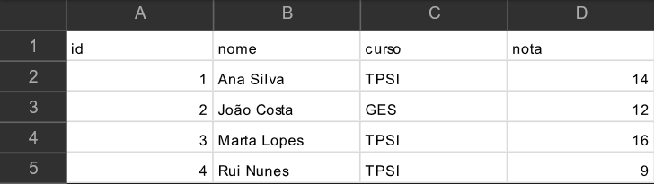

# Aula 09/09/2025 &nbsp;  &nbsp; 

 

 Na primeira aula da unidade curricular, o professor apresentou o método de avaliação e os conteúdos que serão abordados ao longo do semestre. 

 Na parte prática da aula, foi realizada uma tarefa composta por três partes: na primeira, preenchemos um questionário diagnóstico; na segunda, resolvemos alguns exercícios; e na terceira, respondemos a um questionário sobre a tarefa anterior (dificuldades, ferramentas utilizadas, entre outros). 

 A tarefa revelou-se relativamente fácil, embora tenha sido necessário fazer algumas adaptações, como, por exemplo, substituir a utilização do Excel pela tecnologia SQL. 

