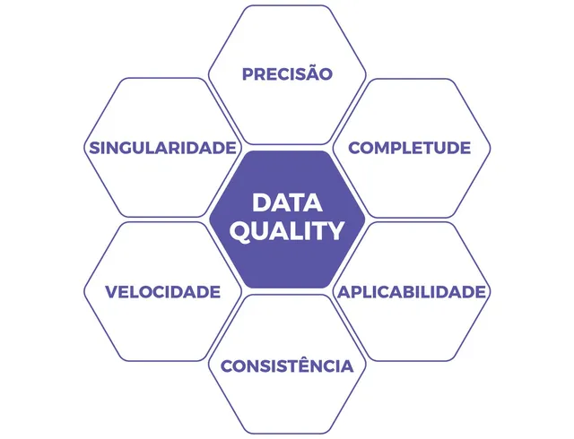

# Aula 14/10/2025 &nbsp;  &nbsp;  &nbsp; 

A aula inicio-se por uma proposta de resolução de tarefa da aula anterior ([tarefa 3](../fichas/tarefa3)), seguida da aula teórica onde foram obordados temas como Qualidade e consistência dos dados e Gestão da Qualidade de Dados (DQM) e a sua importância

Na aula prática realizamos uma tarefa com 5 exercícios, sendo o último em python.

## Conteúdos Abordados

- [Qualidade e Consistência de Dados](../apontamentos/qualidade%20e%20consistencia%20de%20dados.md)
- [Gestão da Qualidade de Dados (DQM)](../apontamentos/DQM.md)

## Resolução de exercícios

[tarefa 4](../fichas/tarefa4)
