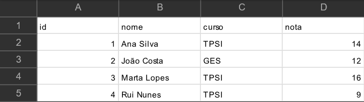

# Aula 26/09/2025 &nbsp;  &nbsp;  &nbsp; 

 

 
A primeira aula da unidade curricular o professor apresentou o método de avaliação e os conteúdos que vão ser abordados durante o semestre.

Na parte prática da aula foi realizada uma tarefa com três partes, a primeira preenchemos um questionário diagnóstico, a segunda resolvemos alguns exercicios e a terceira foi um questionário, referente à tarefa anterior (dificuldades, ferramentas utilizadas,...).

