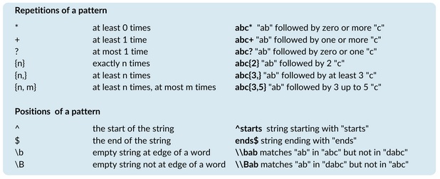

# Aula 21/10/2025 &nbsp;  &nbsp;  &nbsp; 

 

A aula abordou as <strong>Técnicas de Validação de Dados</strong> e as <strong>Métricas de Qualidade de Dados</strong>. 
Foram apresentadas várias técnicas de validação, como regras e restrições de integridade, validação de formato, intervalo e tipo de dados, validação cruzada e <em>data profiling</em>. 
Também foram introduzidos conceitos de limpeza, normalização e tratamento de valores em falta.

Foram ainda explicadas métricas como a completude, unicidade, validade e consistência, usadas para avaliar a qualidade dos dados. 
Na parte prática, aplicámos estes conceitos em Python, na Tarefa 5, que envolveu leitura, deteção de problemas, tratamento, normalização e exportação dos dados.

## Conteúdos Abordados

- [Técnicas de Validação de Dados](../apontamentos/tecnicas%20de%20validacao%20de%20dados.md)

## Resolução de exercícios

- [Tarefa 5](../fichas/tarefa5.md)
