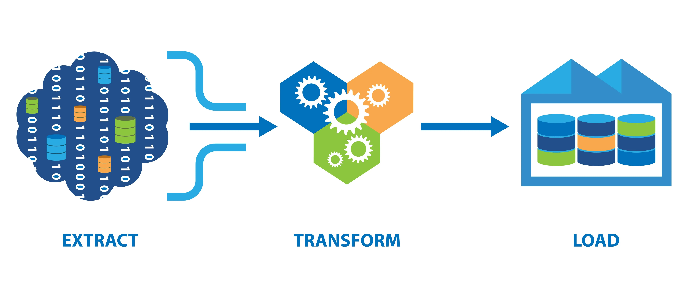

# Aula 25/11/2025 &nbsp;  &nbsp;  &nbsp; 

 

Esta aula foi inteiramente dedicada ao desenvolvimento do <strong>Projeto Final</strong>. O tempo foi utilizado para avançar nas primeiras fases do trabalho, focando na análise conceptual e no início do processo de mapeamento ETL.

<strong>Progresso realizado:</strong>

<ul>
  <li>Conclusão da <strong>Fase 1 - Análise e Design Conceptual</strong> (Requisitos, Arquitetura e Glossário).</li>
  <li>Início da <strong>Fase 2 - Mapeamento e Processo ETL</strong> (Realização do Mapeamento de Dados).</li>
</ul>

## Projeto Final
- [Planeamento e Resolução do Projeto](../projeto_final.md)
