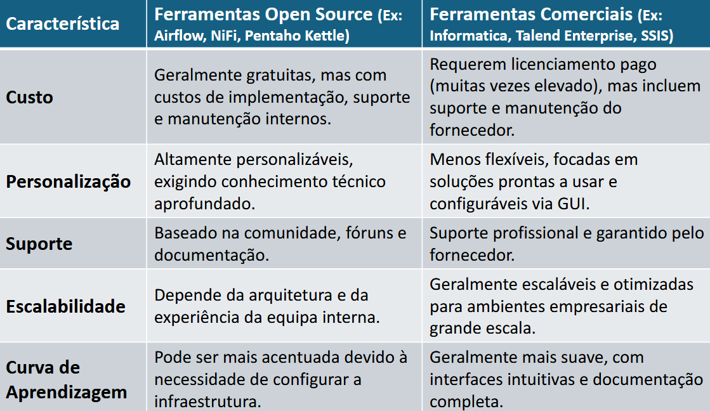

# Aula 28/10/2025 &nbsp;  &nbsp;  &nbsp; 

 

A aula centrou-se no <strong>papel das ferramentas no processo ETL/ELT</strong>, abordando:

<ul>
  <li>A importância da <strong>automação</strong> na integração de dados e a forma como estas ferramentas gerem fluxos complexos de extração, transformação e carregamento.</li>
  <li>A <strong>classificação</strong> das ferramentas em <strong>Open Source</strong> (ex.: Airflow, NiFi, Pentaho Kettle) e <strong>Comerciais</strong> (ex.: Talend, SSIS), destacando as principais diferenças ao nível do custo, suporte e escalabilidade.</li>
  <li>Os <strong>critérios de seleção</strong> de uma ferramenta ETL, incluindo conectividade, desempenho, facilidade de uso, custo total e suporte técnico.</li>
  <li>As <strong>principais ferramentas estudadas</strong>:
    <ul>
      <li><strong>Apache NiFi</strong></li>
      <li><strong>Apache Airflow</strong></li>
      <li><strong>Pentaho Data Integration (Kettle)</strong></li>
      <li><strong>Talend</strong></li>
      <li><strong>SSIS</strong></li>
      <li>Ferramentas <strong>cloud</strong> como <strong>AWS Glue</strong>, <strong>Azure Data Factory</strong> e <strong>Google Dataflow</strong>, orientadas para escalabilidade e processamento distribuído.</li>
    </ul>
  </li>
  <li>No final, foi reforçado o papel das <strong>linguagens de programação (Python e SQL)</strong> na integração de dados, especialmente quando são necessárias soluções personalizadas.</li>
</ul>

Na componente prática, realizámos a <strong>Tarefa 6</strong>, que consistiu em efetuar a extração, transformação e carregamento de dados utilizando ficheiros <code>CSV</code> e <code>JSON</code>. 
Na fase de transformação, substituímos valores <code>NaN</code>, criámos uma nova coluna e gerámos uma nova tabela com dados derivados através de cálculos baseados na primeira tabela.

## Conteúdos Abordados

- [Técnicas de Validação de Dados](../apontamentos/ferramentas_ETL_ELT)

## Resolução de exercícios

- [Tarefa 6](../fichas/tarefa6.md)
